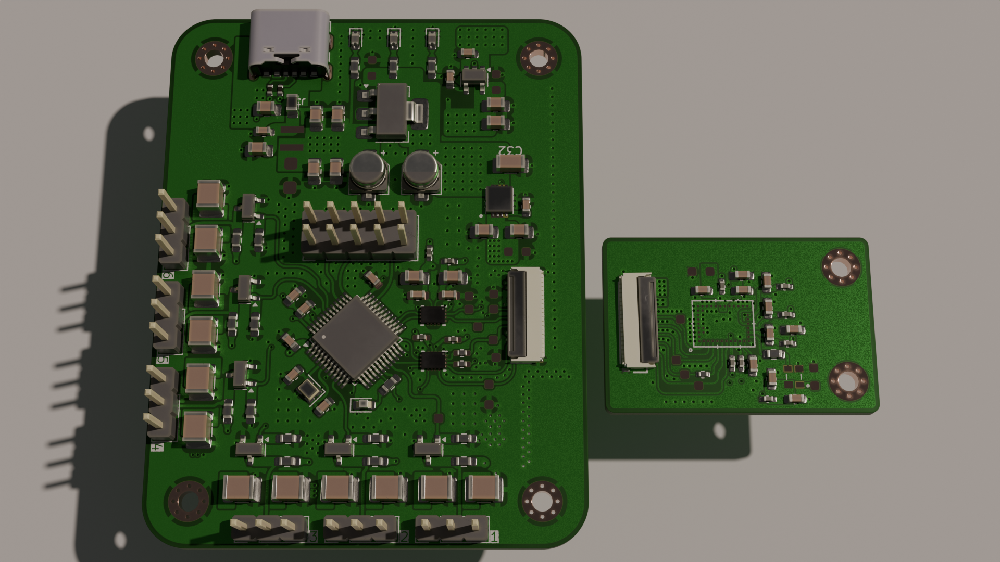

# BGT60 Servo Driver Board

A USB-C powered control board built around an STM32U5 microcontroller, featuring a FFC connector interface to a BGT60TR13C radar daughterboard for non-contact sensing, and six independent DC motor/servo outputs for actuation.

